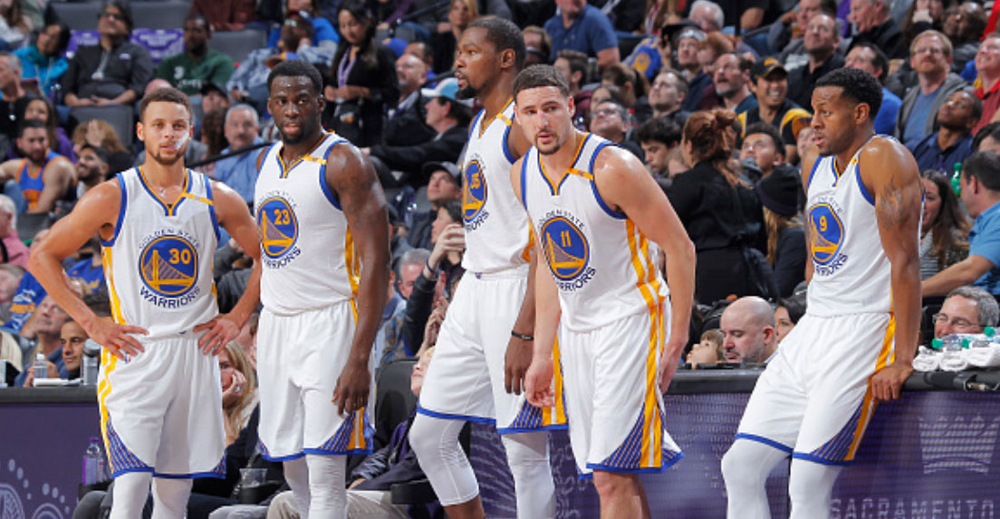
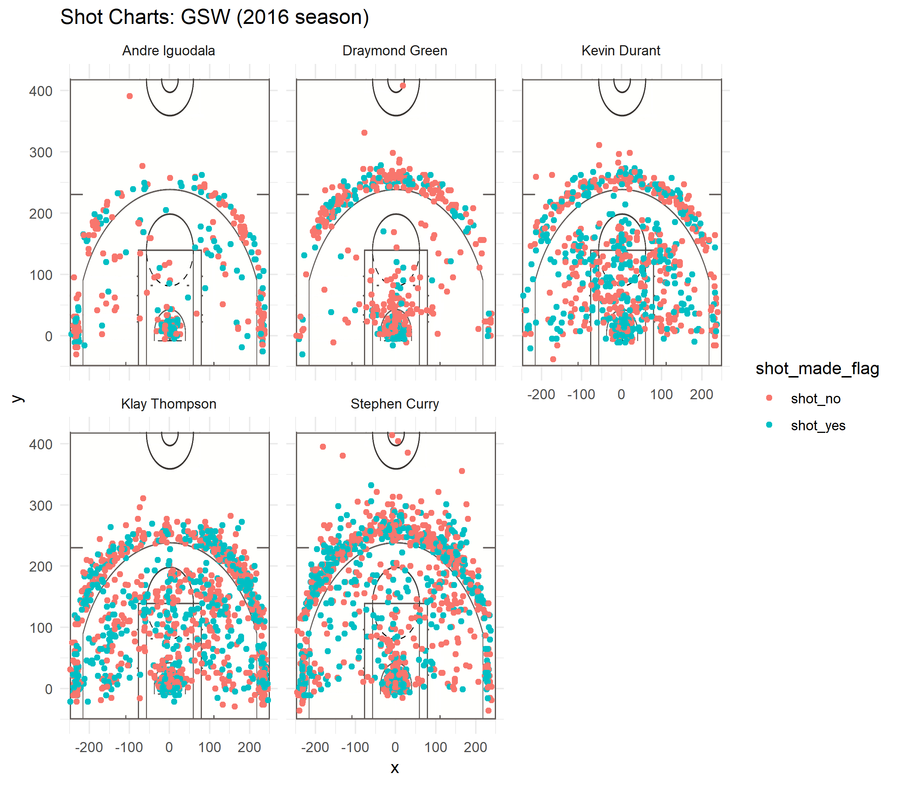

```{r setup, include=FALSE}
knitr::opts_chunk$set(echo = TRUE)
library(dplyr)
library(gridExtra)
library(gtable)
```

## Introduction
Every fan probably knows the names and capabilities of the Golden State Warriors team, but a true fan dives even deeper into the numbers and stats of their performances.  

Below, we will take a close look at the shooting accuracies for a handful of the GSW team, factoring in the location they took the shot.  This will give us a better look at the types of shots these GSW players are making and losing.  


The dataset we have access to is available [here](https://github.com/ucb-stat133/stat133-hws) and includes records for players Stephen Curry, Draymond Green, Kevin Durant, Klay Thompson, and Andre Iguodala, seen here from left to right:

```{r out.width = "80%", echo = FALSE, fig.align = "center"}
knitr:: 

```


## Effective Shooting Percentages

For each of our players, we can look at the total shots they took, and break those total shots into the shots they made against what they didn't make.  


First off, let's look at the percentages for our five players based on ALL types of shots.  The code looks like this:

```{r}
shots_data <- read.csv("../data/shots-data.csv", header = TRUE,stringsAsFactors = FALSE)

all_shooting <- data.frame(name = rep(NA, 5), total = rep(NA, 5), made=rep(NA,5), stringsAsFactors = FALSE)

#Iguodala
all_shooting[1,] <- list("Andre Iguodala", nrow(filter(shots_data, name == "Andre Iguodala")), nrow(filter(shots_data, name == "Andre Iguodala", shot_made_flag == "shot_yes")))

#Curry
all_shooting[2,] <- list("Stephen Curry", nrow(filter(shots_data, name == "Stephen Curry")), nrow(filter(shots_data, name == "Stephen Curry", shot_made_flag == "shot_yes")))

#Green
all_shooting[3,] <- list("Draymond Green", nrow(filter(shots_data, name == "Draymond Green")), nrow(filter(shots_data, name == "Draymond Green", shot_made_flag == "shot_yes")))

#Thompson
all_shooting[4,] <- list("Klay Thompson", nrow(filter(shots_data, name == "Klay Thompson")), nrow(filter(shots_data, name == "Klay Thompson", shot_made_flag == "shot_yes")))

#Durant
all_shooting[5,] <- list("Kevin Durant", nrow(filter(shots_data, name == "Kevin Durant")), nrow(filter(shots_data, name == "Kevin Durant", shot_made_flag == "shot_yes")))


all_shooting <- mutate(all_shooting, perc_made = made/total) %>% arrange(desc(perc_made))


table <- grid.table(all_shooting, rows=NULL)

```

Durant has the highest percentage and he's made quite a lot of shots.  However, Thompson and Curry make considerably more shots, and their total percentages are relatively close to Durant's.  Green's percentage is pretty low, and he hasn't made that many shots, either.  

We can also take a look at two pointer shots. We're seeing a significant difference with the number of 2 pointers shot by these 5 players.  Durant, Curry, and Thompson are shooting a lot more of these and getting high accuracies.  Iguodala has shot the least, although he has the best accuracy.  Green has also not shot that many relatively, and his accuracy is the lowest.

```{r echo=FALSE}

two_shooting <- data.frame(name = rep(NA, 5), total = rep(NA, 5), made=rep(NA,5), stringsAsFactors = FALSE)


#Iguodala
two_shooting[1,] <- list("Andre Iguodala", nrow(filter(shots_data, name == "Andre Iguodala", shot_type == "2PT Field Goal")), nrow(filter(shots_data, name == "Andre Iguodala", shot_type == "2PT Field Goal", shot_made_flag == "shot_yes")))

#Curry
two_shooting[2,] <- list("Stephen Curry", nrow(filter(shots_data, name == "Stephen Curry", shot_type == "2PT Field Goal")), nrow(filter(shots_data, name == "Stephen Curry", shot_type == "2PT Field Goal", shot_made_flag == "shot_yes")))


#Green
two_shooting[3,] <- list("Draymond Green", nrow(filter(shots_data, name == "Draymond Green", shot_type == "2PT Field Goal")), nrow(filter(shots_data, name == "Draymond Green", shot_type == "2PT Field Goal", shot_made_flag == "shot_yes")))


#Thompson
two_shooting[4,] <- list("Klay Thompson", nrow(filter(shots_data, name == "Klay Thompson", shot_type == "2PT Field Goal")), nrow(filter(shots_data, name == "Klay Thompson", shot_type == "2PT Field Goal", shot_made_flag == "shot_yes")))


#Durant
two_shooting[5,] <- list("Kevin Durant", nrow(filter(shots_data, name == "Kevin Durant", shot_type == "2PT Field Goal")), nrow(filter(shots_data, name == "Kevin Durant", shot_type == "2PT Field Goal", shot_made_flag == "shot_yes")))


two_shooting <- mutate(two_shooting, perc_made = made/total) %>% arrange(desc(perc_made))


grid.table(two_shooting, rows=NULL)

```


We can finally take a look at 3 point shots.  The table below shows us that the best 3 point shooters of these 5 GSW players are Thompson and Curry.  They shoot the most of them and have the highest accuracy.  The three others have accuracies in the 30's, and do not shoot them as much.  Because 3 pointers are harder shots to make, we're seeing overall lower percentages than the 2 pointers.

```{r echo=FALSE}

three_shooting <- data.frame(name = rep(NA, 5), total = rep(NA, 5), made=rep(NA,5), stringsAsFactors = FALSE)


#Iguodala

three_shooting[1,] <- list("Andre Iguodala", nrow(filter(shots_data, name == "Andre Iguodala", shot_type == "3PT Field Goal")), nrow(filter(shots_data, name == "Andre Iguodala", shot_type == "3PT Field Goal", shot_made_flag == "shot_yes")))


#Curry

three_shooting[2,] <- list("Stephen Curry", nrow(filter(shots_data, name == "Stephen Curry", shot_type == "3PT Field Goal")), nrow(filter(shots_data, name == "Stephen Curry", shot_type == "3PT Field Goal", shot_made_flag == "shot_yes")))


#Green
three_shooting[3,] <- list("Draymond Green", nrow(filter(shots_data, name == "Draymond Green", shot_type == "3PT Field Goal")), nrow(filter(shots_data, name == "Draymond Green", shot_type == "3PT Field Goal", shot_made_flag == "shot_yes")))

#Thompson
three_shooting[4,] <- list("Klay Thompson", nrow(filter(shots_data, name == "Klay Thompson", shot_type == "3PT Field Goal")), nrow(filter(shots_data, name == "Klay Thompson", shot_type == "3PT Field Goal", shot_made_flag == "shot_yes")))

#Durant

three_shooting[5,] <- list("Kevin Durant", nrow(filter(shots_data, name == "Kevin Durant", shot_type == "3PT Field Goal")), nrow(filter(shots_data, name == "Kevin Durant", shot_type == "3PT Field Goal", shot_made_flag == "shot_yes")))

three_shooting <- mutate(three_shooting, perc_made = made/total) %>% arrange(desc(perc_made))

grid.table(three_shooting, rows=NULL)
```


```{r include=FALSE}
pdf("../output/all_shots.pdf",height = 11, width = 8.5)
grid.table(all_shooting)
dev.off()
```
```{r include=FALSE}
pdf("../output/two_shots.pdf",height = 11, width = 8.5)
grid.table(two_shooting)
dev.off()
```

```{r include=FALSE}
pdf("../output/three_shots.pdf",height = 11, width = 8.5)
grid.table(three_shooting)
dev.off()
```


##Facetted Shot Charts

Our facetted shot charts shown below give us visual insight into the amount of each different shot made by our players.  We can easily see who is shooting more (with Curry at the top and Iguodala at the bottom) as well as who is making a lot of their shots in what location.  

We can see interesting trends through this visualization, such as how the accuracy of shots made close to the basket are close to the same for all the players (an even distribution of red and blues).  We're also seeing how many shots Draymond Green has failed to make, and how he shoots especially rarely from the sides of the court.  Stephen Curry and Klay Thompson have a huge distribution in the shots their making (and missing). 


```{r out.width = "80%", echo = FALSE, fig.align = "center"}
knitr:: 

```

## Conclusion

By diving deep into our numbers, we're getting a better idea of our GSW players and how their accuracies range in comparison to each other and by their location on the court.  We're seeing that our strongest shooters are Durant, Thompson and Curry, because they shoot the most and have high accuracies.  We might even consider giving the ball more to Durant, since he has the highest overall percentage for all his shots.  

Iguodala does not shoot that much, but he has a pretty good track record with his 2-pointers, at 63% compared to Draymond's 49%.  Draymond Green should probably pass it to one of the other 4 players instead of shooting. He consistently scores the least accurate.

A great next step to dive further into our data would be to conduct a similar analysis on defensive moves, perhaps by looking at ball stealing or blocking on defense.  This is motivated by the fact that we looked so critically at Draymond Green's poor shooting record, but he might be a really strong defensive players.  Or, we could look at how our players are passing. Perhaps Green is responsible for setting up all the other players for their amazing shots. 

Clearly, there are a lot of advantages to diving into the numbers and conducting this analysis.  Hopefully this report has given you something to geek out about with your fellow basketball fanatics!