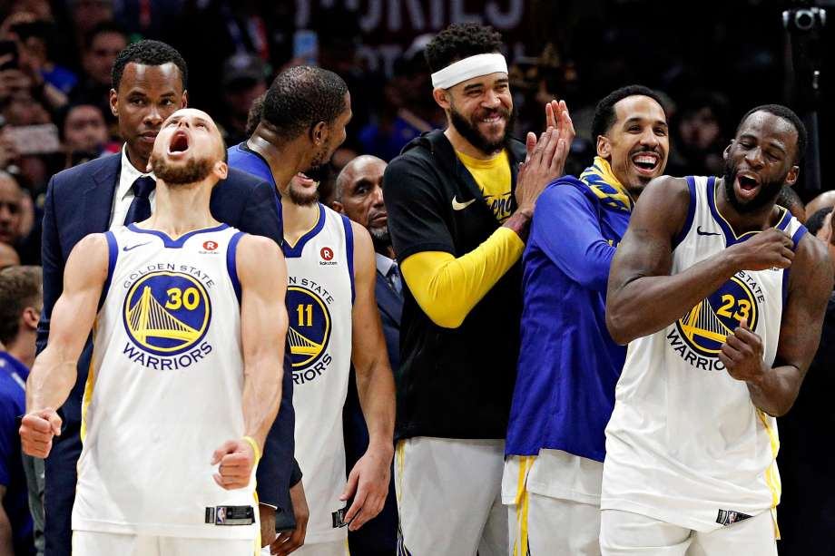

workout-01-alicia-kim
================
Alicia Kim
March 5, 2019

Introduction
------------

Every fan probably knows the names and capabilities of the Golden State Warriors team, but a true fan dives even deeper into the numbers and the stats of their performances.

Below, we take a close look at the shooting accuracies for a handful of the GSW team. This allows us to see which players have stronger shots in different locations on the court, and which of our members are stronger shooting members overall.

The dataset we have access to is available [here](https://github.com/ucb-stat133/stat133-hws) and includes records for players Stephen Curry, Draymond Green, Kevin Durant, Klay Thompson, and Andre Iguodala, seen here from left to right:


Effective Shooting Percentages
------------------------------

For each of our players, we can look at the total shots they took, and break those total shots into the shots they made against what they didn't make.

First off, let's look at the percentages for our five players based on ALL types of shots. The code looks like this:

``` r
shots_data <- read.csv("../data/shots-data.csv", header = TRUE,stringsAsFactors = FALSE)

all_shooting <- data.frame(name = rep(NA, 5), total = rep(NA, 5), made=rep(NA,5), stringsAsFactors = FALSE)

#Iguodala
all_shooting[1,] <- list("Andre Iguodala", nrow(filter(shots_data, name == "Andre Iguodala")), nrow(filter(shots_data, name == "Andre Iguodala", shot_made_flag == "shot_yes")))

#Curry
all_shooting[2,] <- list("Stephen Curry", nrow(filter(shots_data, name == "Stephen Curry")), nrow(filter(shots_data, name == "Stephen Curry", shot_made_flag == "shot_yes")))

#Green
all_shooting[3,] <- list("Draymond Green", nrow(filter(shots_data, name == "Draymond Green")), nrow(filter(shots_data, name == "Draymond Green", shot_made_flag == "shot_yes")))

#Thompson
all_shooting[4,] <- list("Klay Thompson", nrow(filter(shots_data, name == "Klay Thompson")), nrow(filter(shots_data, name == "Klay Thompson", shot_made_flag == "shot_yes")))

#Durant
all_shooting[5,] <- list("Kevin Durant", nrow(filter(shots_data, name == "Kevin Durant")), nrow(filter(shots_data, name == "Kevin Durant", shot_made_flag == "shot_yes")))


all_shooting <- mutate(all_shooting, perc_made = made/total) %>% arrange(desc(perc_made))
```

And we generate our table below:

**Accuracy for All Shots by Player**

``` r
all_shooting
```

                name total made perc_made
    1   Kevin Durant   915  495 0.5409836
    2 Andre Iguodala   371  192 0.5175202
    3  Klay Thompson  1220  575 0.4713115
    4  Stephen Curry  1250  584 0.4672000
    5 Draymond Green   578  245 0.4238754

As we can see, Durant has the highest percentage and he's made quite a lot of shots. However, Thompson and Curry make considerably more shots, and their total percentages are relatively close to Durant's. Green's percentage is pretty low, and he hasn't made that many shots, either.

We can also take a look at two pointer shots.

**Accuracy for 2 Point Shots by Player**

                name total made perc_made
    1 Andre Iguodala   210  134 0.6380952
    2   Kevin Durant   643  390 0.6065319
    3  Stephen Curry   563  304 0.5399645
    4  Klay Thompson   640  329 0.5140625
    5 Draymond Green   346  171 0.4942197

We're seeing a significant difference with the number of 2 pointers shot by these 5 players. Durant, Curry, and Thompson are shooting a lot more of these and getting high accuracies. Iguodala has shot the least, although he has the best accuracy. Green has also not shot that many relatively, and his accuracy is the lowest.

We can finally take a look at 3 point shots.

**Accuracy for 3 Point Shots by Player**

                name total made perc_made
    1  Klay Thompson   580  246 0.4241379
    2  Stephen Curry   687  280 0.4075691
    3   Kevin Durant   272  105 0.3860294
    4 Andre Iguodala   161   58 0.3602484
    5 Draymond Green   232   74 0.3189655

This table shows us that the best 3 point shooters of these 5 GSW players are Thompson and Curry. They shoot the most of them and have the highest accuracy. The three others have accuracies in the 30's, and do not shoot them as much. Because 3 pointers are harder shots to make, we're seeing overall lower percentages than the 2 pointers.

Facetted Shot Charts
--------------------

Our facetted shot charts shown below give us visual insight into the amount of each different shot made by our players. We can easily see who is shooting more (with Curry at the top and Iguodala at the bottom) as well as who is making a lot of their shots in what location.

We can see interesting trends through this visualization, such as how the accuracy of shots made close to the basket are close to the same for all the players (an even distribution of red and blues). We're also seeing how many shots Draymond Green has failed to make, and how he shoots especially rarely from the sides of the court. Stephen Curry and Klay Thompson have a huge distribution in the shots their making (and missing).


Conclusion
----------

By diving deep into our numbers, we're getting a better idea of our GSW players and how their accuracies range in comparison to each other and by their location on the court. We're seeing that our strongest shooters are Durant, Thompson and Curry, because they shoot the most and have high accuracies. We might even consider giving the ball more to Durant, since he has the highest overall percentage for all his shots.

Iguodala does not shoot that much, but he has a pretty good track record with his 2-pointers, at 63% compared to Draymond's 49%. Draymond Green should probably pass it to one of the other 4 players instead of shooting. He consistently scores the least accurate.

A great next step to dive further into our data would be to conduct a similar analysis on defensive moves, perhaps by looking at ball stealing or blocking on defense. This is motivated by the fact that we looked so critically at Draymond Green's poor shooting record, but he might be a really strong defensive players. Or, we could look at how our players are passing. Perhaps Green is responsible for setting up all the other players for their amazing shots.

Clearly, there are a lot of advantages to diving into the numbers and conducting this analysis. Hopefully this report has given you something to geek out about with your fellow basketball fanatics!


